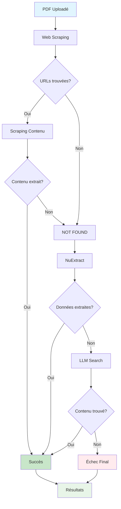

# Workflow Condensé

```mermaid
flowchart TD
    A[PDF Uploadé] --> B[Web Scraping]
    B --> C{URLs trouvées?}
    C -->|Oui| D[Scraping Contenu]
    C -->|Non| E[NOT FOUND]
    D --> F{Contenu extrait?}
    F -->|Oui| G[Succès]
    F -->|Non| E
    E --> H[NuExtract]
    H --> I{Données extraites?}
    I -->|Oui| G
    I -->|Non| J[LLM Search]
    J --> K{Contenu trouvé?}
    K -->|Oui| G
    K -->|Non| L[Échec Final]
    
    G --> M[Résultats]
    L --> M
    
    style A fill:#e1f5fe
    style G fill:#c8e6c9
    style L fill:#ffebee
    style M fill:#e8f5e8
``` 