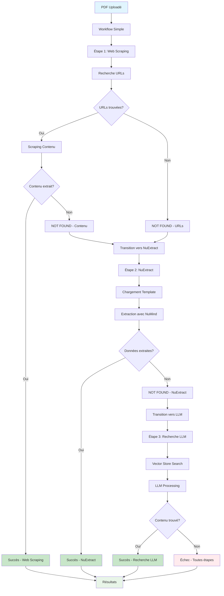
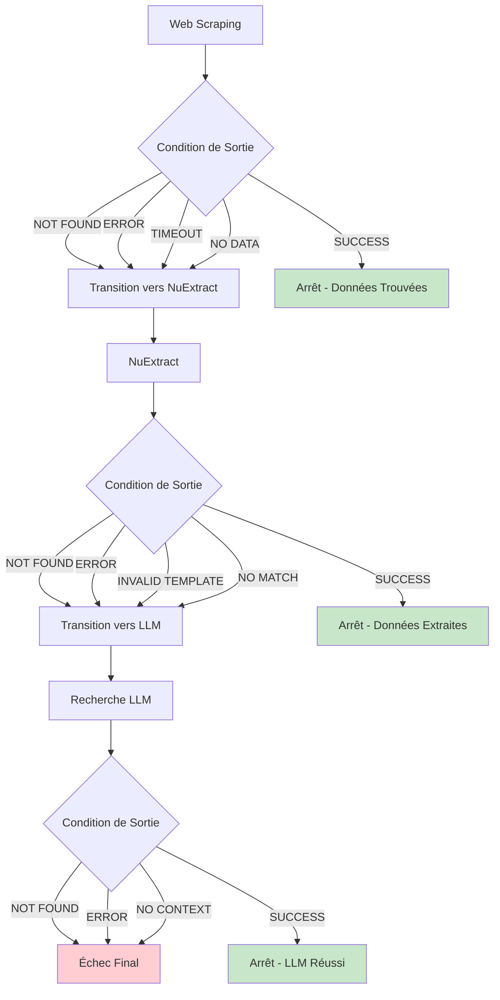
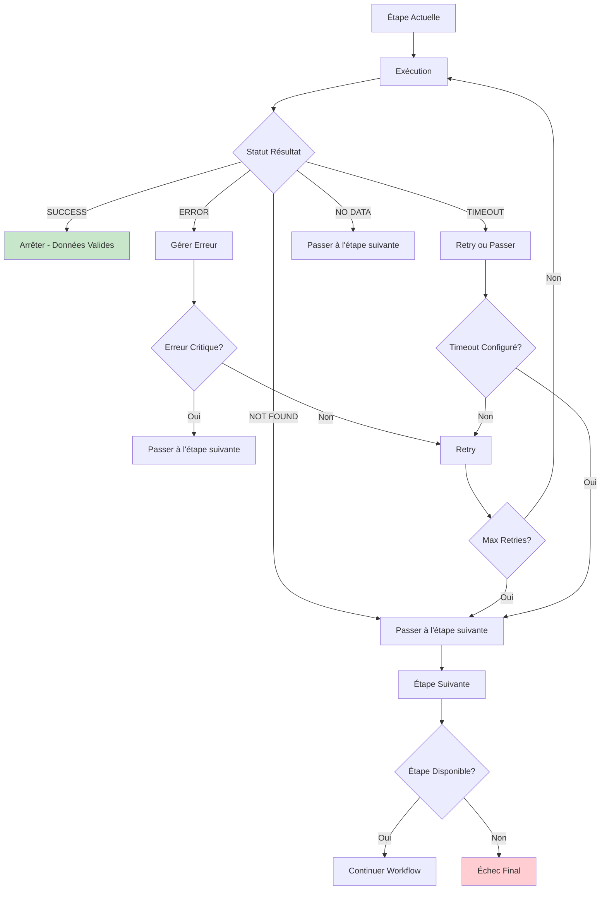
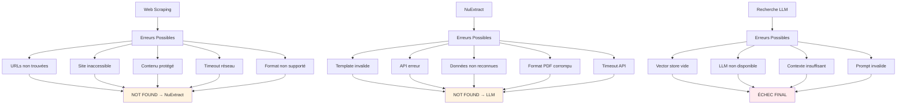
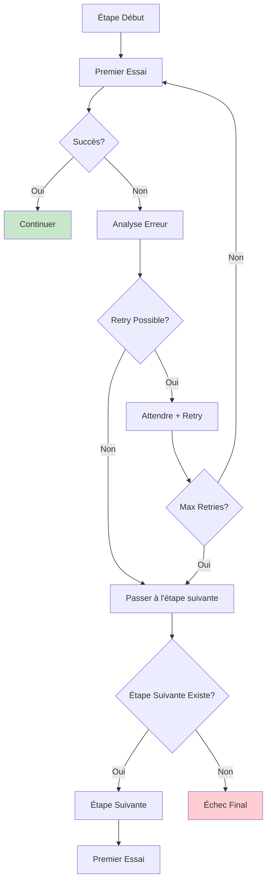

# Workflow Détaillé - Transitions entre Étapes

## Workflow Principal avec Transitions

## Détail des Conditions de Transition

## Logique de Décision Détaillée

## Gestion des Erreurs par Étape

## Workflow avec Retry Logic

