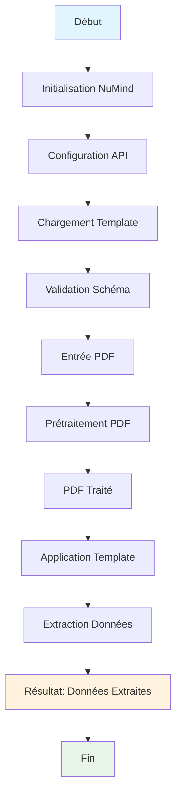
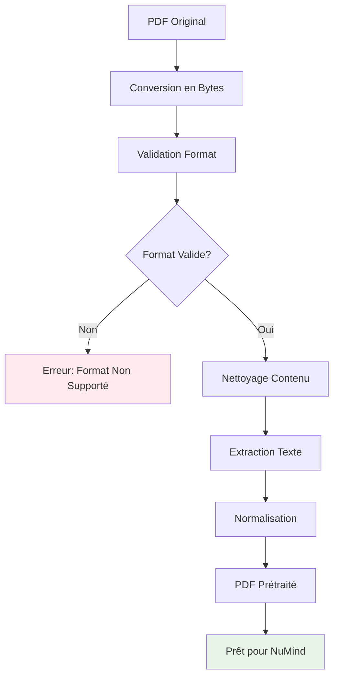
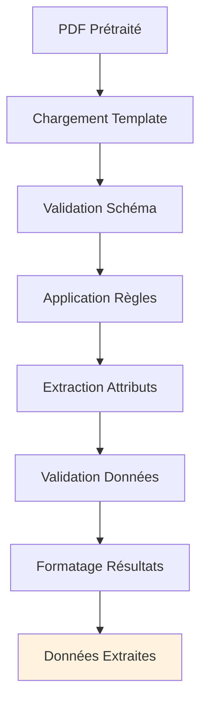
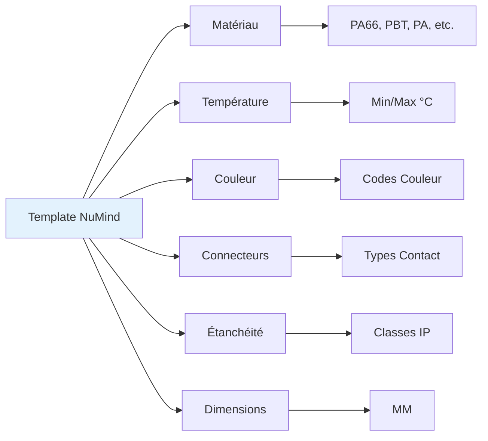
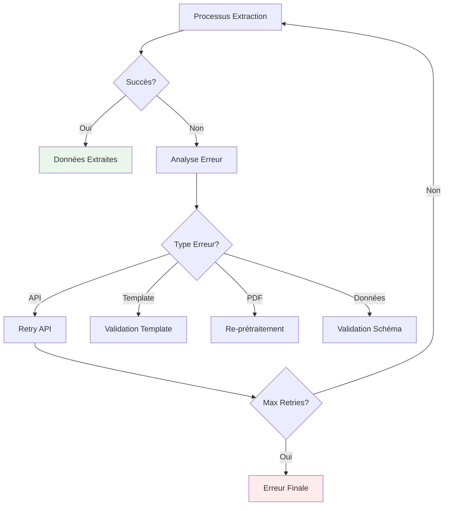
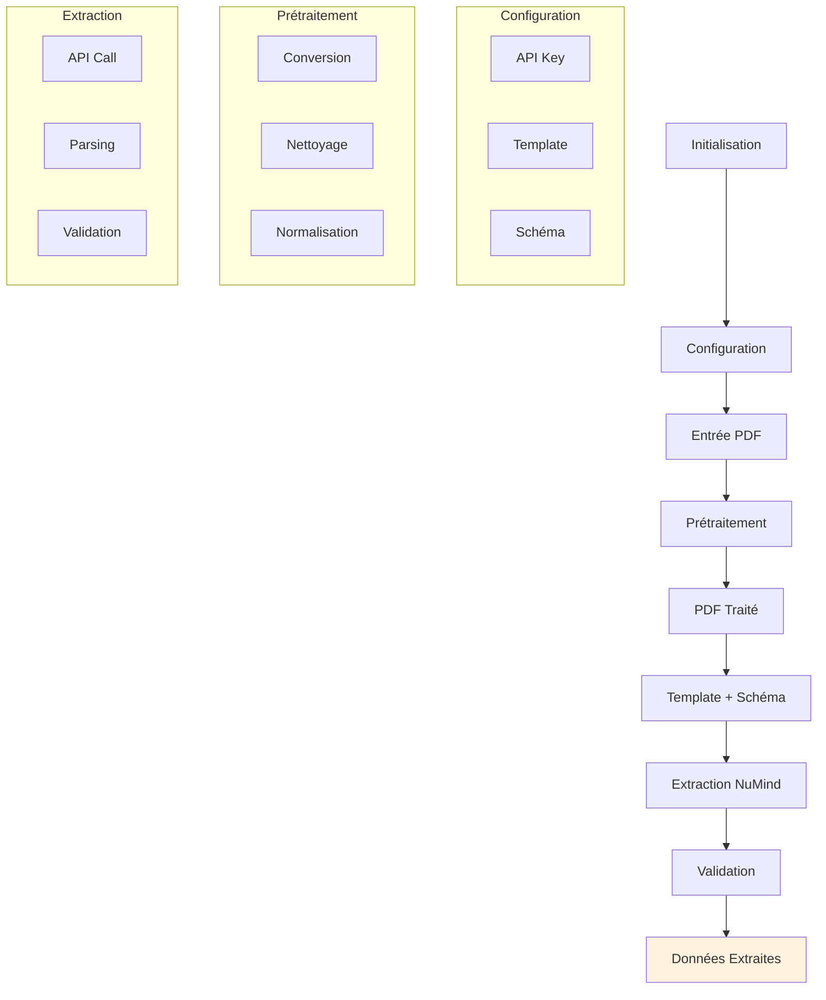
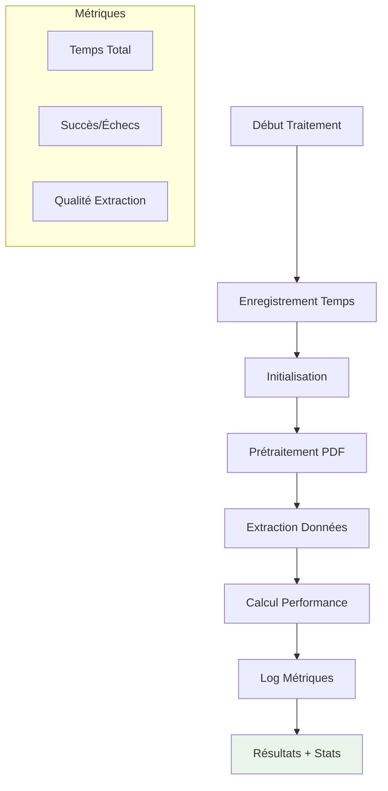
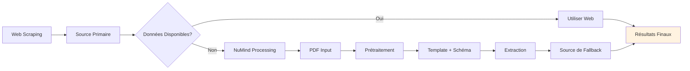

# Workflow NuMind - Processus d'Extraction de Données

## Workflow Principal

## Détail du Processus de Prétraitement

## Application du Template et Extraction

## Schéma Template et Attributs

## Gestion des Erreurs

## Flux de Données Complet

## Métriques et Performance

## Intégration avec Système Existant

