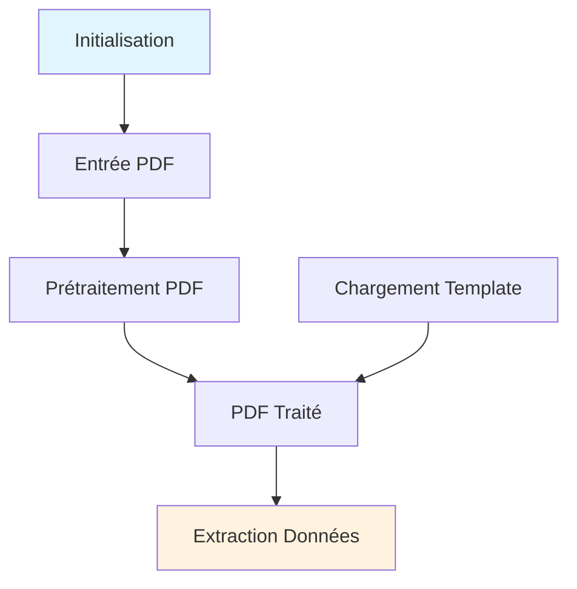

# Workflow Simple NuMind

```mermaid
flowchart TD
    A[Initialisation] --> B[Entrée PDF]
    B --> C[Prétraitement PDF]
    C --> D[PDF Traité]
    E[Chargement Template] --> D
    D --> F[Extraction Données]
    
    style A fill:#e1f5fe
    style F fill:#fff3e0
``` 